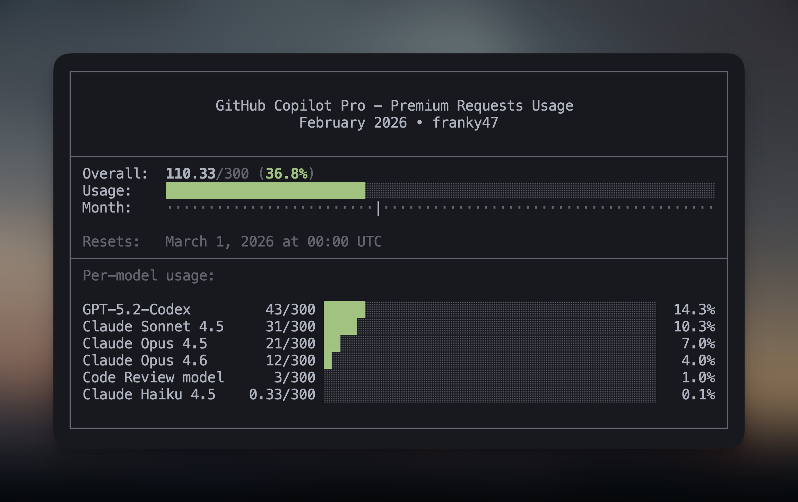

Display your usage of GitHub Copilot premium requests for this month.



## Features

- Shows a summary of your usage
- Where we are in the current month
- A breakdown of usage per-model

The month indicator helps you spread out your usage to max out your plan:

- Usage left of the month indicator? Prompt away! 🤖
- Usage right of the month indicator? Go touch some grass. 🌿

## Pre-requisites

- [Bun](https://bun.com/)
- [`gh`](https://cli.github.com/) GitHub CLI
- Authenticated with a user scope (run it the first time and it will ask you to re-auth if necessary).
- Configure your `LIMIT` in `usage.ts` to whatever your GitHub Copilot plan is (300 premium requests for Pro).

To install dependencies:

```bash
bun install
```

## Running it

```bash
bun run usage.ts
```

This project was created using `bun init` in bun v1.3.8.
